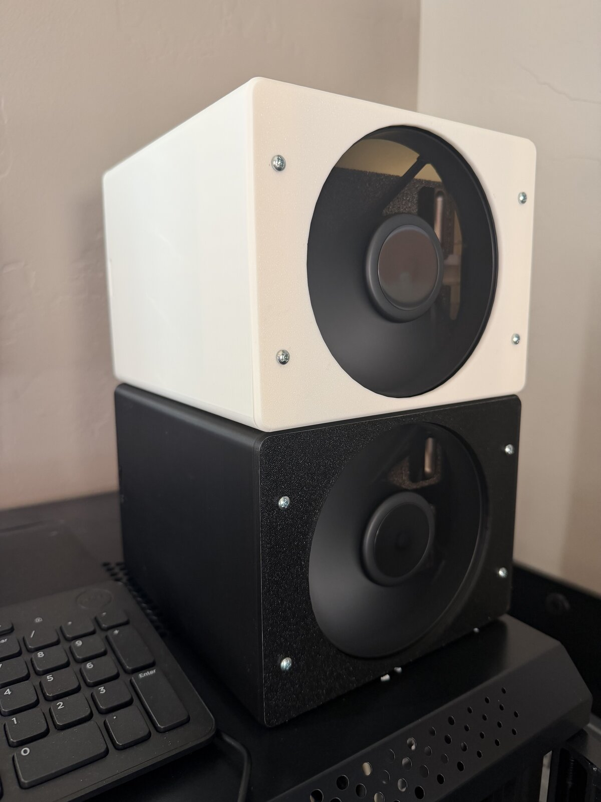
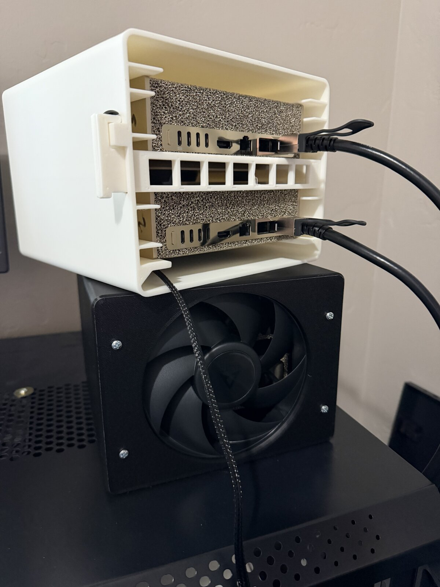
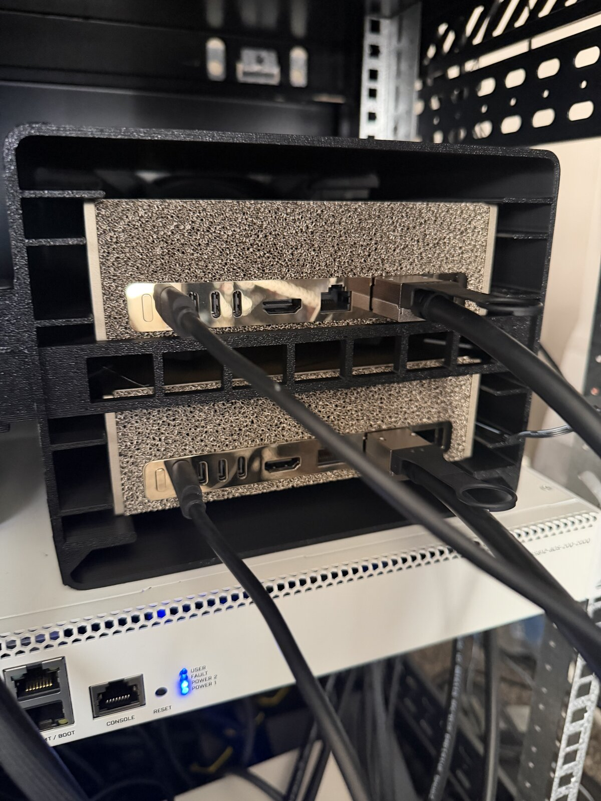
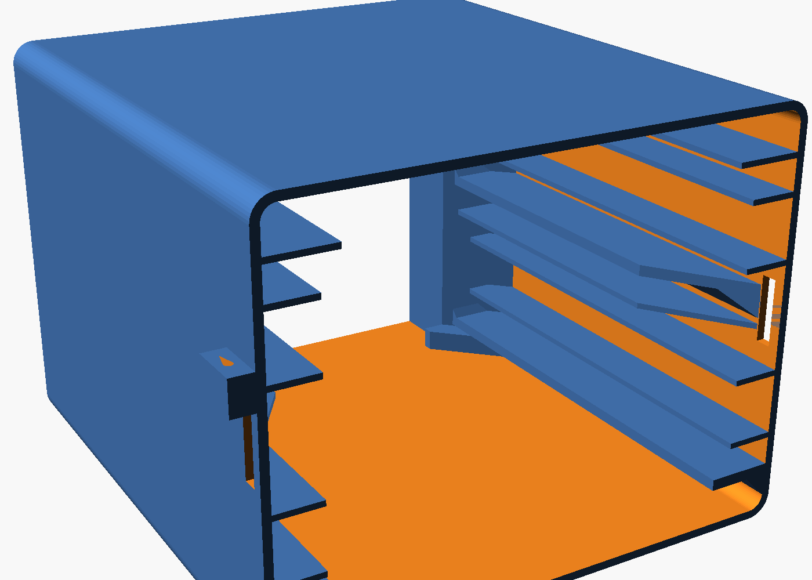
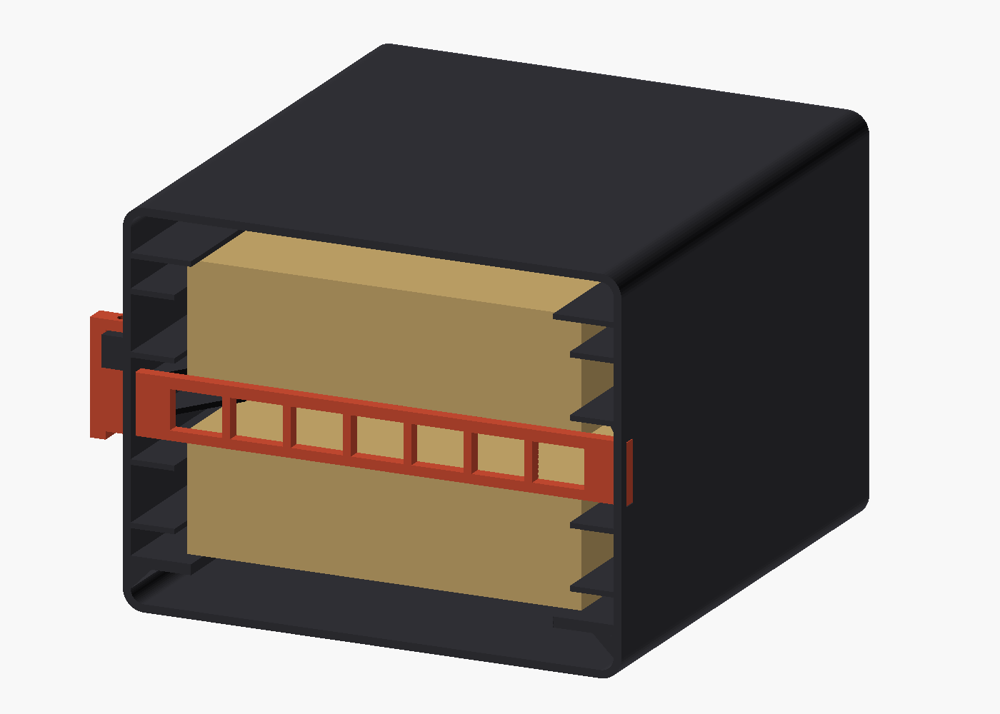
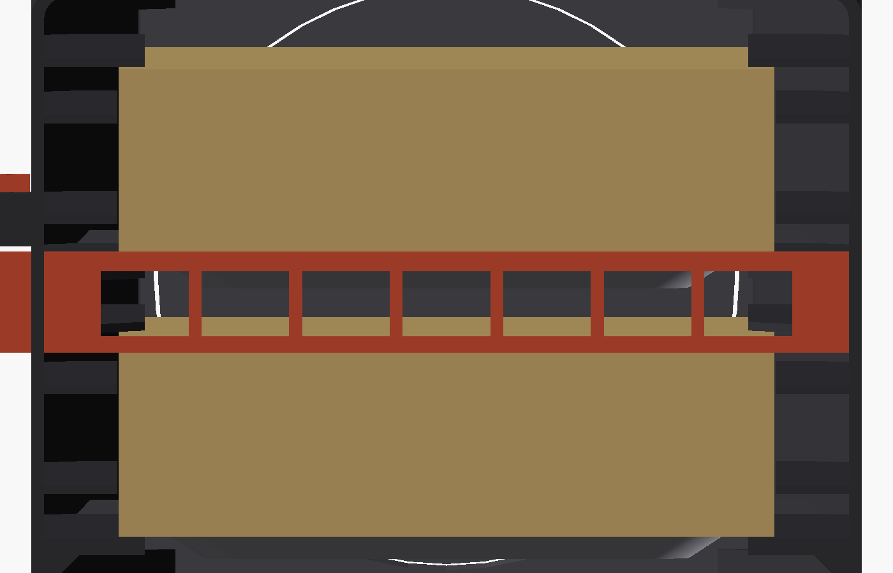
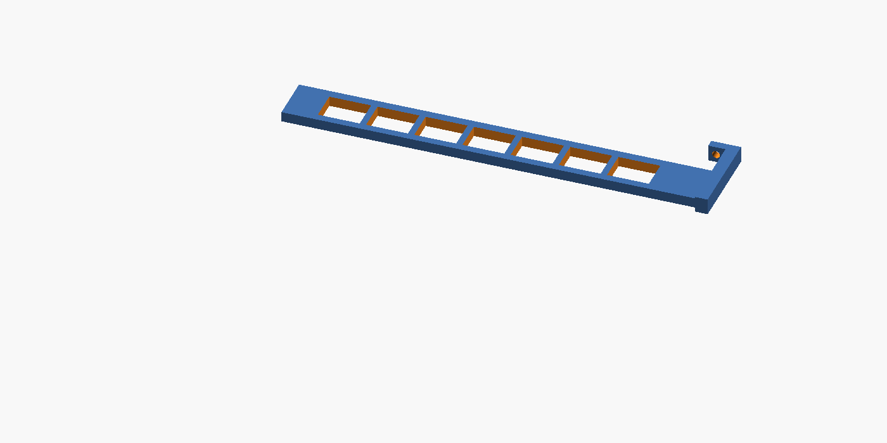

# spark-tunnel-share — a 3D-printed wind tunnel for two NVIDIA DGX Sparks

A printed ducted box that force-cools **two DGX Spark mini computers
stacked flat**, one above the other, with a single 140 mm fan at the front
and an open rear. Three of these cases were built and put into daily
service; this repo is the version-four design exactly as built — the CAD,
the printable STLs, the settings that worked, and the ones that didn't.



## What v4 is

Two Sparks lie flat, one above the other, behind a screwed-on fan bezel,
with the rear open. Versus the earlier versions (see
[docs/DESIGN-HISTORY.md](docs/DESIGN-HISTORY.md)):

- **No center tray.** An earlier design supported the upper machine on a
  middle plate; it was 2–3 mm too tight and printed badly. The upper Spark
  now rides on **C-channel side supports** molded into the side walls: a
  reinforced bottom ledge, a top ledge, and flow-parallel ribs between.
- **Positive retention.** The fan bezel is **screwed** on with four #6-32
  screws and the rear locking bar is screwed down with one more — no
  friction fits or snap hooks holding the computers in.
- **Vented rear bar (rev 8).** The solid rear bar blocked the rear exit of
  the 17 mm air gap between the Sparks; it now has seven 20 x 15 mm windows
  while the 3 mm retaining lips stay solid.

Air path: fan → plenum → through both Sparks and around them through an
equal 17 mm gap on every side → open rear. The equal-gap layout and the
opening-area reasoning are in [docs/SPEC.md](docs/SPEC.md); measured cooling
numbers (and their honest limits) are in [docs/THERMAL.md](docs/THERMAL.md).

## Printed parts

| Part | STL | Print time | Material | Notes |
|---|---|---|---|---|
| Body | [stl/body.stl](stl/body.stl) | ~12 h | ~720 g PLA | prints rear face down, warp recipe (see below) |
| Bezel | [stl/bezel.stl](stl/bezel.stl) | 58–69 min | ~50 g PLA | front face down |
| Lock bar | [stl/lockbar.stl](stl/lockbar.stl) | ~30 min | ~20 g PLA | vented rev 8, rear face down |

Print settings and the failure log that produced them — corner warping, the
brim widths that fixed it, bed temperature, and a nozzle-blob/first-layer
story — are in [docs/PRINT-NOTES.md](docs/PRINT-NOTES.md). The short
version: PLA, bed 65 °C, 15 mm inner+outer brim on the body, part fan
15–30 % and off for the first five layers, one part per plate.

## Bill of materials

| Item | Qty | Spec |
|---|---|---|
| NVIDIA DGX Spark | 2 | 45 x 150 x 150 mm body (measured) |
| Arctic P14 Pro fan | 1 | 140 x 140 x 27 mm, 4-pin, 400–2500 rpm |
| #6-32 screws | 5 | 4x bezel into the printed fan rails, 1x lock-bar tab into the wall pad |
| PLA filament | ~800 g | per case |
| Printed parts | 3 | above |

The pedestal height and flare dimensions used in the CAD are from the
community design [jvr0x/dgx-spark-rack](https://github.com/jvr0x/dgx-spark-rack)
(measured from a reference STL) — worth verifying against your own machine
with a rule; the box geometry is parametric if you need to adjust.

## Regenerating the STLs from the CAD

The single parametric source is `cad/spark-box-v4.scad` (OpenSCAD). Each
part module also outputs in its print orientation:

```sh
openscad -o stl/body.stl    -D 'part="body"'    cad/spark-box-v4.scad
openscad -o stl/bezel.stl   -D 'part="bezel"'   cad/spark-box-v4.scad
openscad -o stl/lockbar.stl -D 'part="lockbar"' cad/spark-box-v4.scad
```

`part="assembly"` and `part="cutaway"` (the default is assembly) render the
full box; a set of `chk_*` parts support the fit checks. The file also
echoes the front-face vs bypass-gap area ratio on every load.

## Photos

Assembled black and white cases, front and rear:




CAD renders (OpenSCAD):






## Credit

- [jvr0x/dgx-spark-rack](https://github.com/jvr0x/dgx-spark-rack) —
  measured DGX Spark pedestal dimensions used in the CAD.
- The rear locking-bar concept follows the community "whpthomas" rack bar
  idea, adapted to screwed retention and ventilation.

## License

MIT — see [LICENSE](LICENSE). Copyright (c) 2026 spark-tunnel-share
contributors.
